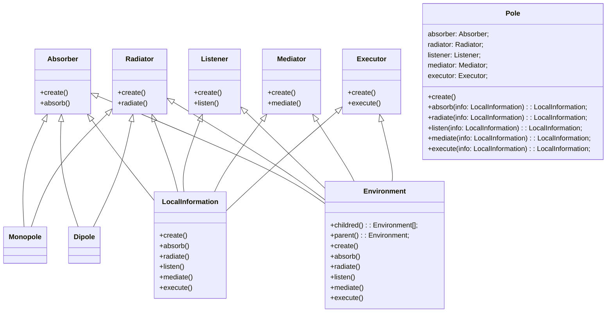

# tri-polar representation

## summary

tri-polar representation is a representation of the world as a tri-pole. the tri-pole is a combination of the absorber, the radiator, and the actor.  the absorber is the pole that absorbs energy from the environment.  the radiator is the pole that radiates energy to the environment.  the actor is the pole that decides what to do.


The absorber is the monopole that absorbs energy from the environment.
The listener is the monopole that listens to the environment.
The executor is the monopole that decides what to do.
The mediator is the monopole that mediates between the absorber and the radiator.
The radiator is the monopole that radiates energy to the environment.

The absorber, the listener, the executor, the mediator, and the radiator are all monopoles.

# dipoles

A dipole is a complete cycle of poles.

local absorber --> global actor --> local radiator
local radiator --> global actor --> local absorber

# monopoles

a monopole is a pole that is not part of a cycle.

local absorber --> global actor
global actor --> local radiator
local radiator --> global actor
global actor --> local absorber

# tripoles

a tripole is a dipole with a local absorber connected to the global actor

```
local absorber --> global radiator --> local radiator
                        |
                        |
                        |
                  local absorber
```

```
global absorber --> local radiator --> global radiator
                        |
                        |
                        |
                  global absorber
```

```
local radiator --> global absorber --> local radiator
                        |
                        |
                        |
                  local radiator
```
```
global radiator --> local absorber --> global radiator
                        |
                        |
                        |
                  global radiator
```

# tripoles are environments

tripoles are environments composed of other environments. The specific values of any object in each environment is opaque to the other environments and only visible as the emergent properties of the environment. This allows for the creation of complex environments that are composed of other environments.

# An API for creating tripolar environments

A simple-but-powerful javascript object model / API for creating tripolar environments is documented below:



## explanation of the code

the above code implements a computer which represents all elements in its universe 
as pentapolar systems - systems of five poles. the poles are: absorber, listener, executor, mediator, and radiator. 
the absorber absorbs information, the listener listens to information, the executor executes information, the mediator 
mediates information, and the radiator radiates information. a pole is an environment, which is a class that contains 
local informations and global information. local informations are information that is local to the pole. global 
information is the information that is global to the pole. a pole also contains a parent environment. a pole has a 
local information that is the global information of the pole, and the pole contains local informations. the pole's 
local informations are the local informations of the pole's parent environment. the pole's local information is 
the global information of the pole's parent environment etc.

### Pole Class

the pole class is the basic computational unit of the computer. the pole class is an environment, which is a class 
(hence is a recursive data structure) that contains local informations and global information. local informations are i
nformation that is local to the pole. global information is the information that is global to the pole. a pole also
contains a parent environment etc. How each of the poles are oriented in relation to each other determines the
computational power of the computer. Each of the poles are oriented in relation to each other in a way that
determines the computational power of the computer, as well as determines how local information is processed. 
Each pole stores its orientation using a Vector3. The pole's orientation is the direction that the pole is oriented
in relation to the pole's parent environment. Some common orientations include:

1. (0, 0, 0) - the pole is oriented in the same direction as the pole's parent environment
2. (1, 0, 0) - the pole is oriented in the opposite direction as the pole's parent environment
3. (0, 1, 0) - the pole is oriented in the same direction as the pole's parent environment, but rotated 90 degrees
4. (0, 0, 1) - the pole is oriented in the same direction as the pole's parent environment, but rotated 90 degrees
5. (1, 1, 0) - the pole is oriented in the opposite direction as the pole's parent environment, but rotated 90 degrees
6. (1, 0, 1) - the pole is oriented in the opposite direction as the pole's parent environment, but rotated 90 degrees
7. (0, 1, 1) - the pole is oriented in the same direction as the pole's parent environment, but rotated 180 degrees
8. (1, 1, 1) - the pole is oriented in the opposite direction as the pole's parent environment, but rotated 180 degrees

# Common Pole Orientations

1. Absorber - (0, 0, 0), Listener - (1, 0, 0), Executor - (0, 1, 0), Mediator - (0, 0, 1), Radiator - (1, 1, 0)
this orientation is the most common orientation. this orientation is the orientation of the human brain. This orientation
represents the human brain (because the human brain is a pentapolar system). This orientation is also the orientation of
the computer.

2. Absorber - (0, 0, 0), Listener - (1, 0, 0), Executor - (0, 0, 1), Mediator - (0, 1, 0), Radiator - (1, 1, 0)
this orientation is also a common orientation. this orientation is the orientation of the human heart. This orientation
represents the human heart (because the human heart is a pentapolar system).

3. Absorber - (0, 0, 0), Listener - (1, 0, 0), Executor - (0, 1, 0), Mediator - (0, 0, 1), Radiator - (1, 1, 1)
this orientation is also a common orientation. this orientation is the orientation of the human stomach. This orientation
represents the human stomach (because the human stomach is a pentapolar system).

4. Absorber - (0, 0, 0), Listener - (1, 0, 0), Executor - (0, 1, 0), Mediator - (0, 0, 1), Radiator - (1, 1, 0)
this orientation is also a common orientation. this orientation is the orientation of the human liver. This orientation
represents the human liver (because the human liver is a pentapolar system).

5. Absorber - (0, 0, 0), Listener - (1, 0, 0), Executor - (0, 1, 0), Mediator - (0, 0, 1), Radiator - (1, 1, 0)
this orientation is also a common orientation. this orientation is the orientation of the human lungs. This orientation
represents the human lungs (because the human lungs is a pentapolar system).

6. Absorber - (0, 0, 0), Listener - (1, 0, 0), Executor - (0, 1, 0), Mediator - (0, 0, 1), Radiator - (1, 1, 0)
this orientation is also a common orientation. this orientation is the orientation of the human pancreas. This orientation
represents the human pancreas (because the human pancreas is a pentapolar system).

# Monopolar Configurations

Monopolar configurations are configurations of one pole. Monopolar configurations are used to represent simple 
computational tasks. For example, a monopolar configuration of an absorber pole can be used to represent a task such as 
reading data from a file. Monopolar configurations are also used to represent basic logic operations such as AND and OR. 
In a monopolar configuration, the pole is oriented in the same direction as the pole's parent environment. Examples of monopoles include:

1. Absorber - (0, 0, 0), Listener - (1, 0, 0), Executor - (0, 1, 0), Mediator - (0, 0, 1), Radiator - (1, 1, 0)
2. Absorber - (0, 0, 0), Listener - (1, 0, 0), Executor - (0, 0, 1), Mediator - (0, 1, 0), Radiator - (1, 1, 0)
3. Absorber - (0, 0, 0), Listener - (1, 0, 0), Executor - (0, 1, 0), Mediator - (0, 0, 1), Radiator - (1, 1, 1)
4. Absorber - (0, 0, 0), Listener - (1, 0, 0), Executor - (0, 1, 0), Mediator - (0, 0, 1), Radiator - (1, 1, 0)
5. Absorber - (0, 0, 0), Listener - (1, 0, 0), Executor - (0, 1, 0), Mediator - (0, 0, 1), Radiator - (1, 1, 0)

# Dipolar Configurations

Dipolar configurations represent dipoles, or two poles which are connected to each other. Dipoles are used to represent 
more complex computations. For example, a dipole of an absorber and a listener can be used to represent a task such as 
reading data from a file and processing it. Dipoles are also used to represent logic operations such as NAND and NOR. 
In a dipolar configuration, the poles are oriented in opposite directions in relation to the pole's parent environment. 
Examples of dipoles include:

1. Absorber - (1, 0, 0), Listener - (0, 0, 0), Executor - (0, 1, 0), Mediator - (0, 0, 1), Radiator - (1, 1, 0)
2. Absorber - (1, 0, 0), Listener - (0, 0, 0), Executor - (0, 0, 1), Mediator - (0, 1, 0), Radiator - (1, 1, 0)
3. Absorber - (1, 0, 0), Listener - (0, 0, 0), Executor - (0, 1, 0), Mediator - (0, 0, 1), Radiator - (1, 1, 1)
4. Absorber - (1, 0, 0), Listener - (0, 0, 0), Executor - (0, 1, 0), Mediator - (0, 0, 1), Radiator - (1, 1, 0)
5. Absorber - (1, 0, 0), Listener - (0, 0, 0), Executor - (0, 1, 0), Mediator - (0, 0, 1), Radiator - (1, 1, 0)

# Tripolar Configurations

Tripolar configurations are configurations of three poles which are connected to each other. Tripolar configurations 
are used to represent more complex computations. For example, a tripolar configuration of an absorber, a listener, 
and an executor can be used to represent a task such as reading data from a file, processing it, and then executing an 
action based on the data. Tripolar configurations are also used to represent more complex logic operations such as 
XOR and XNOR. In a tripolar configuration, the poles are oriented in the same direction in relation to the pole's 
parent environment. Examples of tripoles include:

1. Absorber - (0, 0, 0), Listener - (1, 0, 0), Executor - (0, 1, 0), Mediator - (0, 0, 1), Radiator - (1, 1, 0)
2. Absorber - (0, 0, 0), Listener - (1, 0, 0), Executor - (0, 0, 1), Mediator - (0, 1, 0), Radiator - (1, 1, 0)
3. Absorber - (0, 0, 0), Listener - (1, 0, 0), Executor - (0, 1, 0), Mediator - (0, 0, 1), Radiator - (1, 1, 1)
4. Absorber - (0, 0, 0), Listener - (1, 0, 0), Executor - (0, 1, 0), Mediator - (0, 0, 1), Radiator - (1, 1, 0)
5. Absorber - (0, 0, 0), Listener - (1, 0, 0), Executor - (0, 1, 0), Mediator - (0, 0, 1), Radiator - (1, 1, 0)

# Multipolar Configurations

Multipolar configurations are configurations of more than three poles. Multipolar configurations are used to represent 
the most complex computations. For example, a multipolar configuration of an absorber, a listener, an executor, a 
mediator, and a radiator can be used to represent tasks such as reading data from multiple files, processing it, and 
then executing multiple actions based on the data. Multipolar configurations are also used to represent the most 
complex logic operations. In a multipolar configuration, the poles are oriented in different directions in relation 
to the pole's parent environment. Examples of multipoles include:

1. Absorber - (1, 0, 0), Listener - (1, 0, 1), Executor - (0, 1, 0), Mediator - (0, 0, 1), Radiator - (1, 1, 0)
2. Absorber - (1, 0, 0), Listener - (1, 0, 1), Executor - (0, 0, 1), Mediator - (0, 1, 0), Radiator - (1, 1, 0)
3. Absorber - (1, 0, 0), Listener - (1, 0, 1), Executor - (0, 1, 0), Mediator - (0, 0, 1), Radiator - (1, 1, 1)
4. Absorber - (1, 0, 0), Listener - (1, 0, 1), Executor - (0, 1, 0), Mediator - (0, 0, 1), Radiator - (1, 1, 0)
5. Absorber - (1, 0, 0), Listener - (1, 0, 1), Executor - (0, 1, 0), Mediator - (0, 0, 1), Radiator - (1, 1, 0)

# Representing Multipoles

Multipole shorthand treats each of the vector3s as a binay numerical representation, concatenating all five values together into a single number. For example:

Absorber - (1, 0, 0), Listener - (1, 0, 1), Executor - (0, 1, 0), Mediator - (0, 0, 1), Radiator - (1, 1, 0) becomes 101 101 010 001 110 becomes 1011010100110 binary which is 5798 decimal, 0x16a6 hex.

This shorthand allows for easy representation of multipoles and their orientations, and is used in the computer's programming language to quickly describe the orientation of a multipole.

# Multipole Shorthand

Multipole shorthand is a shorthand notation used to represent multipoles. Multipole shorthand is used to represent 
the most complex computations. For example, a multipolar configuration of an absorber, a listener, an executor, a 
mediator, and a radiator can be used to represent tasks such as reading data from multiple files, processing it, and 
then executing multiple actions based on the data. Multipolar configurations are also used to represent the most 
complex logic operations. In a multipolar configuration, the poles are oriented in different directions in relation 
to the pole's parent environment. Examples of multipoles include:

1. 1011010100110
2. 1011010100110
3. 1011010100111
4. 1011010100110
5. 1011010100110

# Representing Multipoles

Multipole shorthand treats each of the vector3s as a binay numerical representation, concatenating all five values together into a single number. For example:

101 101 010 001 110 becomes 1011010100110 binary which is 5798 decimal, 0x16a6 hex.

This shorthand allows for easy representation of multipoles and their orientations, and is used in the computer's programming language to quickly describe the orientation of a multipole.

# Pole Types

Poles are categorized into five types: Absorbers, Listeners, Executors, Mediators, and Radiators. Each pole type has a unique function in the computer's programming language.

# Absorber

The absorber pole is responsible for absorbing information from its environment. This information is then passed to other poles in the computer. Examples of an absorber include:

- A microphone which absorbs sound waves and converts them into electrical signals.
- A camera which absorbs light waves and converts them into electrical signals.
- A sensor which absorbs a signal from its environment and converts it into an electrical signal.
- A sensor which absorbs a signal from its environment and converts it into a magnetic signal.
- A sensor which absorbs a signal from its environment and converts it into a chemical signal.

# Listener

The listener pole is responsible for listening to the information absorbed by the absorber pole. This information is then passed to other poles in the computer. Examples of a listener include:

- A microphone which listens to the electrical signals absorbed by the absorber pole and converts them into sound waves.
- A camera which listens to the electrical signals absorbed by the absorber pole and converts them into light waves.
- A sensor which listens to the electrical signals absorbed by the absorber pole and converts them into a signal.
- A sensor which listens to the magnetic signals absorbed by the absorber pole and converts them into a signal.
- A sensor which listens to the chemical signals absorbed by the absorber pole and converts them into a signal.

# Executor

The executor pole is responsible for executing the information absorbed by the absorber pole. This information is then passed to other poles in the computer. Examples of an executor include:

- A speaker which executes the electrical signals absorbed by the absorber pole and converts them into sound waves.
- A projector which executes the electrical signals absorbed by the absorber pole and converts them into light waves.
- A motor which executes the electrical signals absorbed by the absorber pole and converts them into mechanical energy.
- A motor which executes the magnetic signals absorbed by the absorber pole and converts them into mechanical energy.
- A motor which executes the chemical signals absorbed by the absorber pole and converts them into mechanical energy.

# Mediator

The mediator pole is responsible for mediating the information absorbed by the absorber pole. This information is then passed to other poles in the computer. Examples of a mediator include:

- A speaker which mediates the electrical signals absorbed by the absorber pole and converts them into sound waves.
- A projector which mediates the electrical signals absorbed by the absorber pole and converts them into light waves.
- A motor which mediates the electrical signals absorbed by the absorber pole and converts them into mechanical energy.
- A motor which mediates the magnetic signals absorbed by the absorber pole and converts them into mechanical energy.
- A motor which mediates the chemical signals absorbed by the absorber pole and converts them into mechanical energy.

# Radiator

The radiator pole is responsible for radiating the information absorbed by the absorber pole. This information is then passed to other poles in the computer. Examples of a radiator include:

- A speaker which radiates the electrical signals absorbed by the absorber pole and converts them into sound waves.
- A projector which radiates the electrical signals absorbed by the absorber pole and converts them into light waves.
- A motor which radiates the electrical signals absorbed by the absorber pole and converts them into mechanical energy.
- A motor which radiates the magnetic signals absorbed by the absorber pole and converts them into mechanical energy.
- A motor which radiates the chemical signals absorbed by the absorber pole and converts them into mechanical energy.

# Mapping Pole Types to Pole Functions

The pole types are mapped to the pole functions as follows:

1. Absorber - (1, 0, 0)
2. Listener - (1, 0, 1)
3. Executor - (0, 1, 0)
4. Mediator - (0, 0, 1)
5. Radiator - (1, 1, 0)

# Pole Functions

Poles have five functions: Absorb, Listen, Execute, Mediate, and Radiate. Each pole function has a unique function in the computer's programming language.

# Absorb

The absorb function is responsible for absorbing information from its environment. This information is then passed to other poles in the computer. Examples of an absorber include:

- A microphone which absorbs sound waves and converts them into electrical signals.
- A camera which absorbs light waves and converts them into electrical signals.
- A sensor which absorbs a signal from its environment and converts it into an electrical signal.
- A sensor which absorbs a signal from its environment and converts it into a magnetic signal.
- A sensor which absorbs a signal from its environment and converts it into a chemical signal.

# Listen

The listen function is responsible for listening to the information absorbed by the absorber pole. This information is then passed to other poles in the computer. Examples of a listener include:

- A microphone which listens to the electrical signals absorbed by the absorber pole and converts them into sound waves.
- A camera which listens to the electrical signals absorbed by the absorber pole and converts them into light waves.
- A sensor which listens to the electrical signals absorbed by the absorber pole and converts them into a signal.
- A sensor which listens to the magnetic signals absorbed by the absorber pole and converts them into a signal.
- A sensor which listens to the chemical signals absorbed by the absorber pole and converts them into a signal.

# Execute

The execute function is responsible for executing the information absorbed by the absorber pole. This information is then passed to other poles in the computer. Examples of an executor include:

- A speaker which executes the electrical signals absorbed by the absorber pole and converts them into sound waves.
- A projector which executes the electrical signals absorbed by the absorber pole and converts them into light waves.
- A motor which executes the electrical signals absorbed by the absorber pole and converts them into mechanical energy.
- A motor which executes the magnetic signals absorbed by the absorber pole and converts them into mechanical energy.
- A motor which executes the chemical signals absorbed by the absorber pole and converts them into mechanical energy.

# Mediate

The mediate function is responsible for mediating the information absorbed by the absorber pole. This information is then passed to other poles in the computer. Examples of a mediator include:

- A speaker which mediates the electrical signals absorbed by the absorber pole and converts them into sound waves.
- A projector which mediates the electrical signals absorbed by the absorber pole and converts them into light waves.
- A motor which mediates the electrical signals absorbed by the absorber pole and converts them into mechanical energy.
- A motor which mediates the magnetic signals absorbed by the absorber pole and converts them into mechanical energy.
- A motor which mediates the chemical signals absorbed by the absorber pole and converts them into mechanical energy.

# Radiate

The radiate function is responsible for radiating the information absorbed by the absorber pole. This information is then passed to other poles in the computer. Examples of a radiator include:

- A speaker which radiates the electrical signals absorbed by the absorber pole and converts them into sound waves.
- A projector which radiates the electrical signals absorbed by the absorber pole and converts them into light waves.
- A motor which radiates the electrical signals absorbed by the absorber pole and converts them into mechanical energy.
- A motor which radiates the magnetic signals absorbed by the absorber pole and converts them into mechanical energy.
- A motor which radiates the chemical signals absorbed by the absorber pole and converts them into mechanical energy.

# Mapping Pole Functions to Pole Types

The pole functions are mapped to the pole types as follows:

1. Absorb - (1, 0, 0)
2. Listen - (1, 0, 1)
3. Execute - (0, 1, 0)
4. Mediate - (0, 0, 1)
5. Radiate - (1, 1, 0)

# Real World Examples

The following are real world examples of poles:

Micropone -> Speaker

This is an example of a pole pair. The microphone is an absorber pole which absorbs sound waves and converts them into electrical signals. The speaker is an executor pole which executes the electrical signals absorbed by the absorber pole and converts them into sound waves.

Camera -> Projector

This is an example of a pole pair. The camera is an absorber pole which absorbs light waves and converts them into electrical signals. The projector is an executor pole which executes the electrical signals absorbed by the absorber pole and converts them into light waves.

# Pole Pair

A pole pair is a pair of poles which are connected to each other. The poles in a pole pair are connected to each other by a wire. The poles in a pole pair can be of different types. The poles in a pole pair can be of different functions. The poles in a pole pair can be of different types and functions. The poles in a pole pair can be of the same type. The poles in a pole pair can be of the same function. The poles in a pole pair can be of the same type and function. The poles in a pole pair can be of different types and the same function. The poles in a pole pair can be of different functions and the same type. The poles in a pole pair can be of the same type and the same function.

# Pole Triad

A pole triad is a triad of poles which are connected to each other. The poles in a pole triad are connected to each other by a wire. The poles in a pole triad can be of different types. The poles in a pole triad can be of different functions. The poles in a pole triad can be of different types and functions. The poles in a pole triad can be of the same type. The poles in a pole triad can be of the same function. The poles in a pole triad can be of the same type and function. The poles in a pole triad can be of different types and the same function. The poles in a pole triad can be of different functions and the same type. The poles in a pole triad can be of the same type and the same function.

# Pole Quad

A pole quad is a quad of poles which are connected to each other. The poles in a pole quad are connected to each other by a wire. The poles in a pole quad can be of different types. The poles in a pole quad can be of different functions. The poles in a pole quad can be of different types and functions. The poles in a pole quad can be of the same type. The poles in a pole quad can be of the same function. The poles in a pole quad can be of the same type and function. The poles in a pole quad can be of different types and the same function. The poles in a pole quad can be of different functions and the same type. The poles in a pole quad can be of the same type and the same function.

# Pole Quint

A pole quint is a quint of poles which are connected to each other. The poles in a pole quint are connected to each other by a wire. The poles in a pole quint can be of different types. The poles in a pole quint can be of different functions. The poles in a pole quint can be of different types and functions. The poles in a pole quint can be of the same type. The poles in a pole quint can be of the same function. The poles in a pole quint can be of the same type and function. The poles in a pole quint can be of different types and the same function. The poles in a pole quint can be of different functions and the same type. The poles in a pole quint can be of the same type and the same function.
