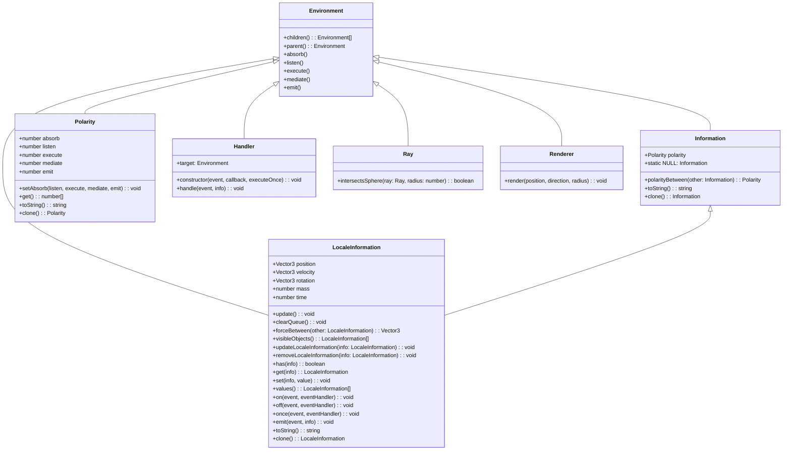
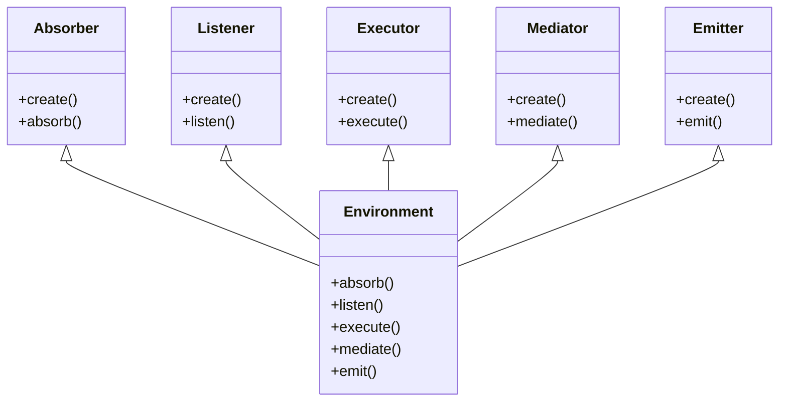
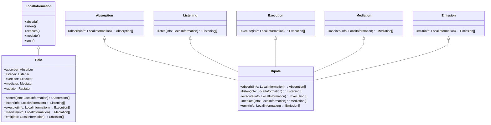
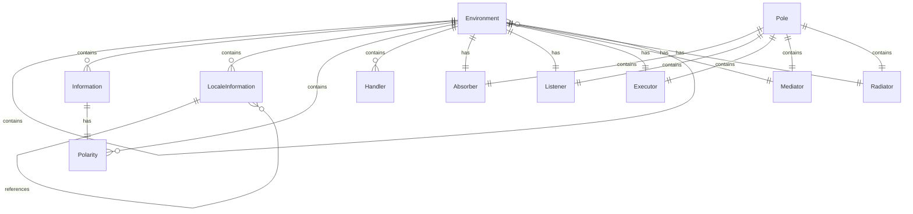
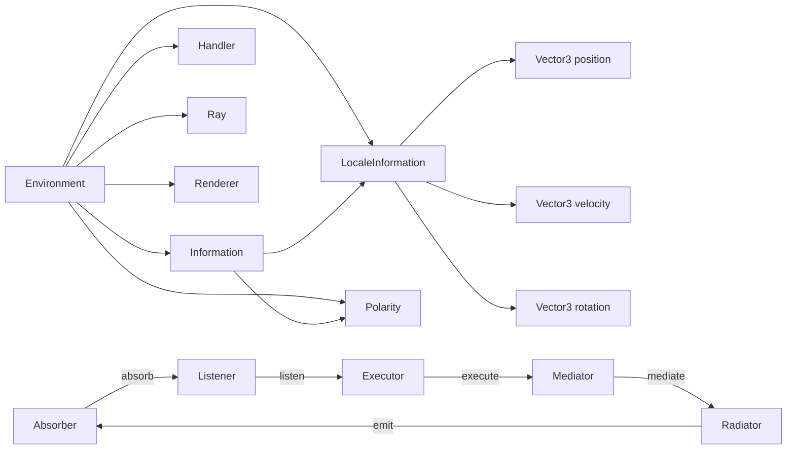

# Pentapolar Class Diagrams

This document contains class diagrams that visually represent the structure and relationships between classes in the pentapolar system.

## Core Class Hierarchy

The following diagram illustrates the inheritance relationships between the main classes in the pentapolar system:

## Specialized Pole Classes

The following diagram shows the relationship between the Environment class and the specialized pole classes:

## Information and Pole Relationships

This diagram illustrates the relationships between information types and pole functions:

## Entity-Relationship Diagram

This diagram visualizes the relationships between the major components in the pentapolar system:

## Component Interaction Flow

This diagram illustrates how the different components interact in the pentapolar system:

These diagrams provide a comprehensive visual representation of the pentapolar system's structure, helping to understand the relationships between components and the flow of information through the system.