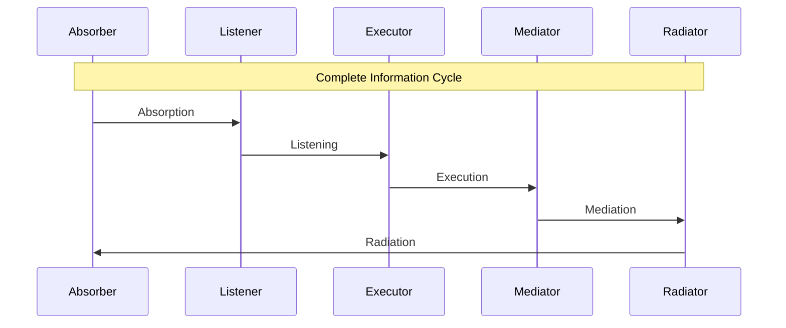
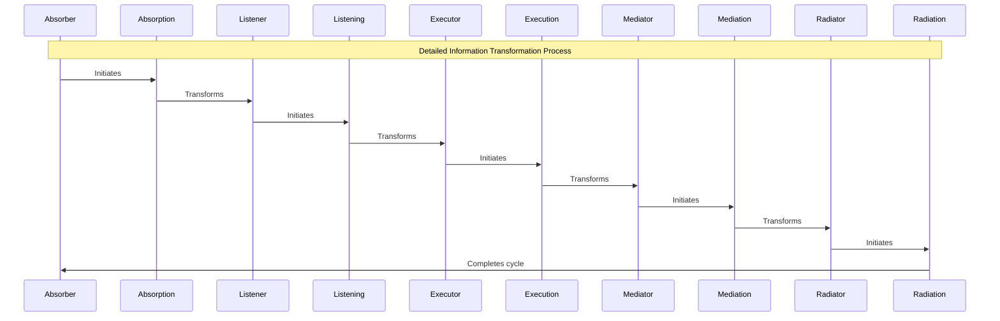
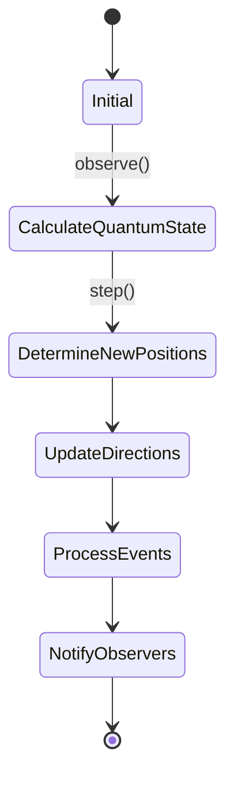
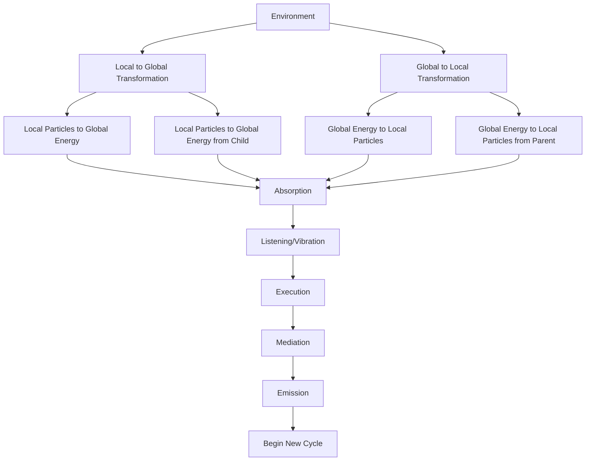
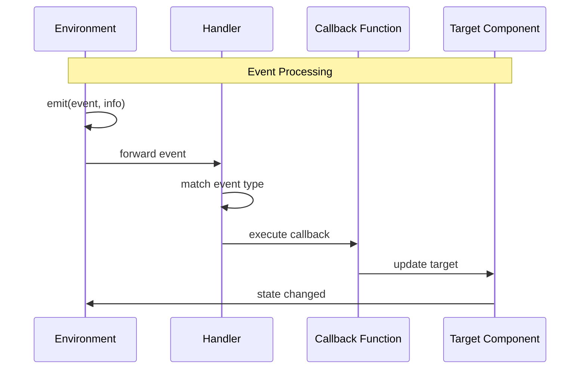
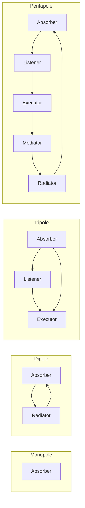
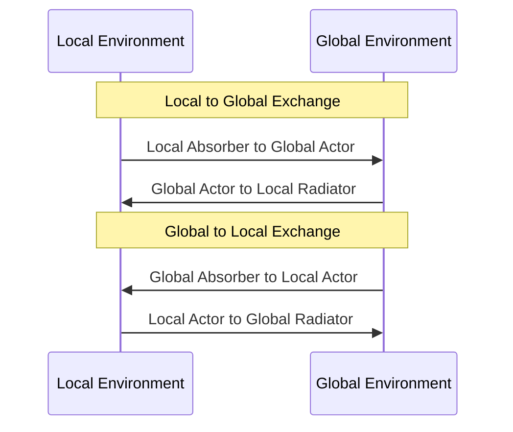
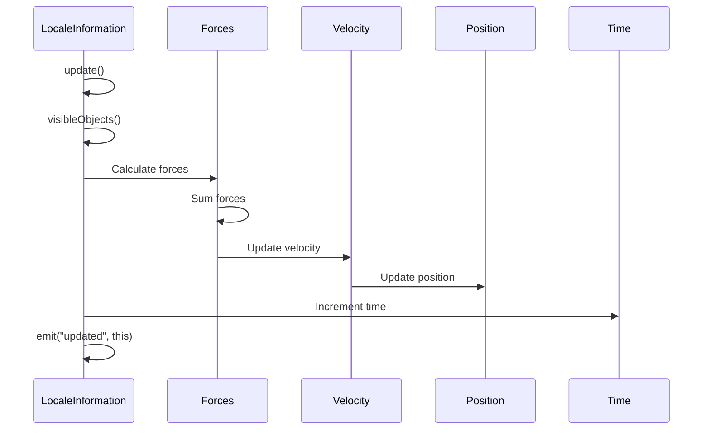
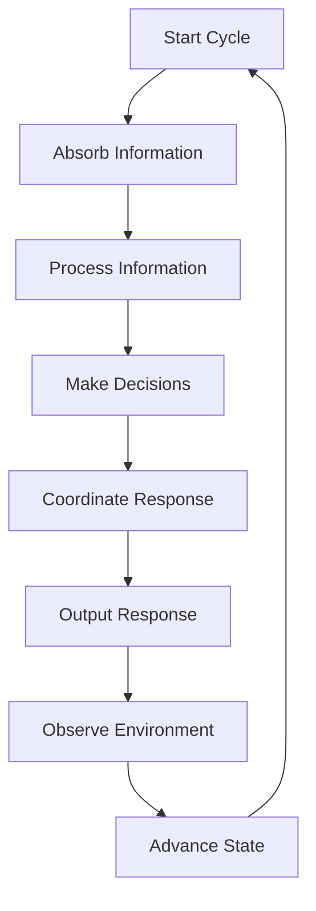

# Pentapolar Logic Flows

This document illustrates the logical flows and sequences in the pentapolar system, showing how information propagates through the different components over time.

## Information Flow Sequence

The following diagram shows the basic flow of information through the five poles in a pentapolar system:

## Detailed Process Flow

This diagram shows the detailed process flow including the intermediate states:

## Environment State Advancement

This diagram illustrates how the environment state advances during the step process:

## Information Transformation Logic

This diagram shows the different information transformation pathways:

## Event Handling Sequence

This diagram illustrates the event handling sequence in the pentapolar system:

## Interaction Between Poles

This diagram shows how poles interact with each other in different configurations:

## Local and Global Information Exchange

This diagram illustrates the exchange of information between local and global environments:

## Object Update Sequence

This diagram shows the update sequence for LocaleInformation objects:

## Complete Processing Cycle

This diagram illustrates a complete processing cycle in the pentapolar system:

These diagrams illustrate the logic flows and sequences in the pentapolar system, providing a visual understanding of how information propagates through the system and how the different components interact over time.