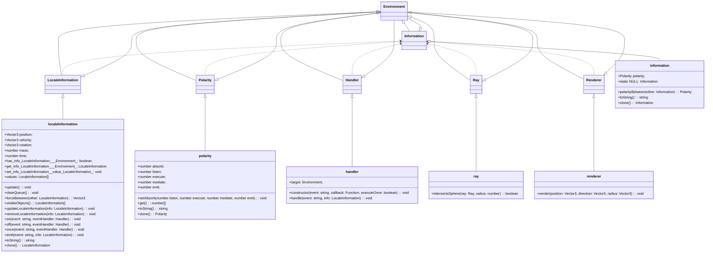
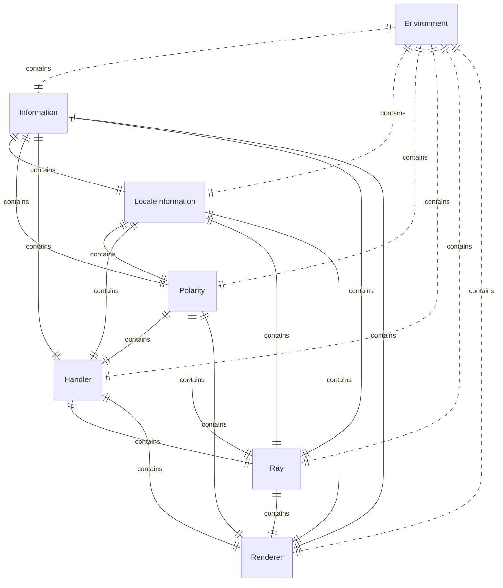

# Class Diagrams
This document contains class diagrams for the various classes in the library. The class diagrams are generated using [Mermaid](http://mermaid.live/). The source code for the class diagrams is in this file. The main description for the system is in the [README.md](../README.md) file.

## Class Diagrams

### Class Diagram

### ER Diagram

