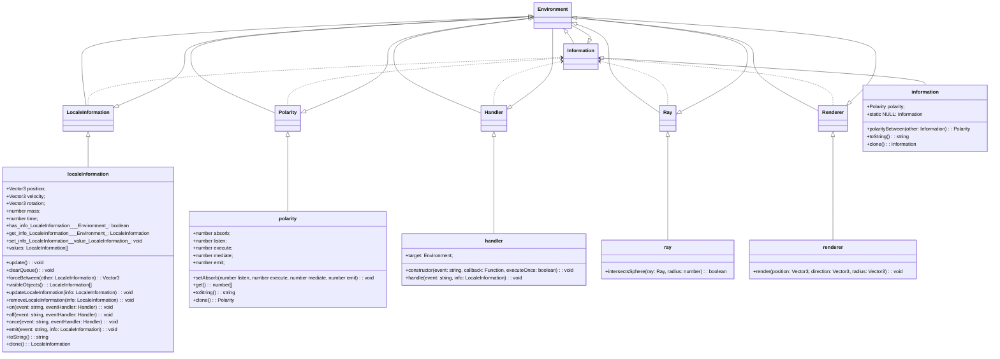
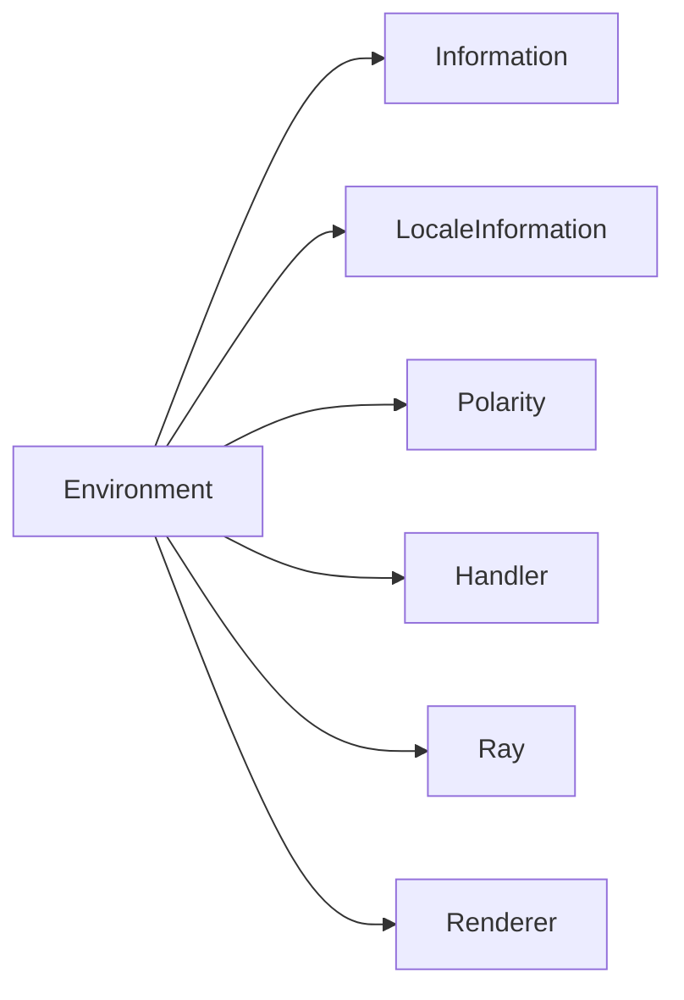
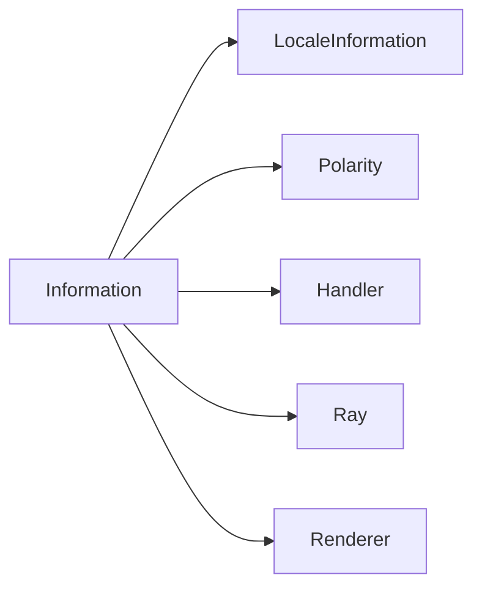
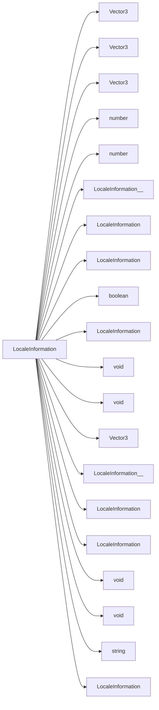
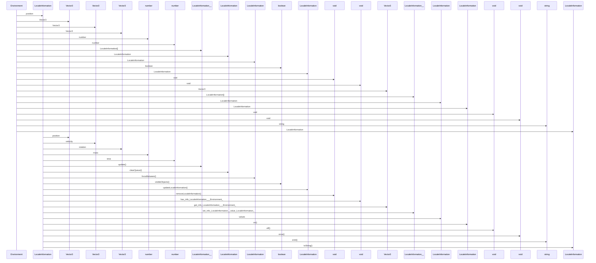

# Logic Diagrams

The following diagrams show the logic of the system. The logic diagrams are generated using [Mermaid](http://mermaid.live/). The source code for the logic diagrams is in this file. The main description for the system is in the [README.md](../README.md) file.

(this above is a temporary fix for the mermaid syntax highlighting in vscode. It will be removed when the syntax highlighting is fixed.)

## Logic Diagrams

