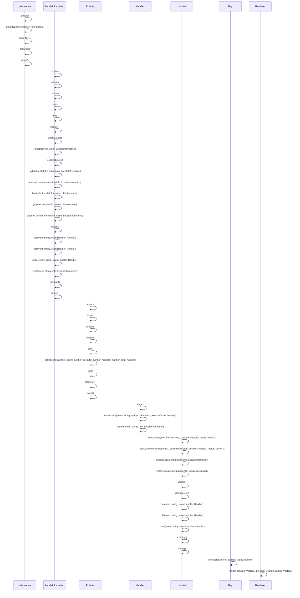

# classes

- Environment
- Information
- LocalInformation
- Polarity
- Handler
- Locality
- Ray
- Renderer

## Environment functions:
- addLocality(info: Environment, position: Vector3, radius: Vector3)
- addLocaleInformation(info: LocaleInformation, position: Vector3, radius: Vector3)
- updateLocaleInformation(info: LocaleInformation)
- removeLocaleInformation(info: LocaleInformation)
- update()
- clearQueue()
- on(event: string, eventHandler: Handler)
- off(event: string, eventHandler: Handler)
- once(event: string, eventHandler: Handler)
- toString()

## Information functions:
- polarity: Polarity
- polarityBetween(other: Information): Polarity
- static NULL: Information
- toString(): string
- clone(): Information

## LocaleInformation functions:
- position: Vector3
- velocity: Vector3
- rotation: Vector3
- mass: number
- time: number
- update(): void
- clearQueue(): void
- forceBetween(other: LocaleInformation): Vector3
- visibleObjects(): LocaleInformation[]
- updateLocaleInformation(info: LocaleInformation): void
- removeLocaleInformation(info: LocaleInformation): void
- has(info: LocaleInformation | Environment): boolean
- get(info: LocaleInformation | Environment): LocaleInformation | undefined
- set(info: LocaleInformation, value: LocaleInformation): void
- values(): LocaleInformation[]
- on(event: string, eventHandler: Handler): void
- off(event: string, eventHandler: Handler): void
- once(event: string, eventHandler: Handler): void
- emit(event: string, info: LocaleInformation): void
- toString(): string
- clone(): LocaleInformation

## Polarity functions:
- get absorb(): number
- set absorb(value: number)
- get listen(): number
- set listen(value: number)
- get execute(): number
- set execute(value: number)
- get mediate(): number
- set mediate(value: number)
- get emit(): number
- set emit(value: number)
- set(absorb: number, listen: number, execute: number, mediate: number, emit: number)
- get(): [number, number, number, number, number]
- toString(): string
- clone(): Polarity

## Handler functions:
- target: any
- constructor(event: string, callback: Function, executeOnce: boolean)
- handle(event: string, info: LocaleInformation): void

## Locality functions:
- addLocality(info: Environment, position: Vector3, radius: Vector3)
- addLocaleInformation(info: LocaleInformation, position: Vector3, radius: Vector3)
- updateLocaleInformation(info: LocaleInformation)
- removeLocaleInformation(info: LocaleInformation)
- update()
- clearQueue()
- on(event: string, eventHandler: Handler)
- off(event: string, eventHandler: Handler)
- once(event: string, eventHandler: Handler)
- toString()
- clone()

## Ray functions:
- intersectsSphere(ray: Ray, radius: number): boolean

## Renderer functions:
- render(position: Vector3, direction: Vector3, radius: Vector3)

# Graph

```mermaid
graph LR
    A[Environment] --> B[Information]
    A --> C[LocaleInformation]
    A --> D[Polarity]
    A --> E[Handler]
    A --> F[Locality]
    A --> G[Ray]
    A --> H[Renderer]
    B --> I[NULL]
    C --> J[position]
    C --> K[velocity]
    C --> L[rotation]
    C --> M[mass]
    C --> N[time]
    C --> O[update]
    C --> P[clearQueue]
    C --> Q[forceBetween]
    C --> R[visibleObjects]
    C --> S[updateLocaleInformation]
    C --> T[removeLocaleInformation]
    C --> U[has_info_LocaleInformation___Environment_]
    C --> V[get_info_LocaleInformation___Environment_]
    C --> W[set_info_LocaleInformation__value_LocaleInformation_]
    C --> X[values]
    C --> Y[on_event_string__eventHandler_Handler_]
    C --> Z[off_event_string__eventHandler_Handler_]
    C --> AA[once_event_string__eventHandler_Handler_]
    C --> AB[emit_event_string__info_LocaleInformation_]
    C --> AC[toString]
    C --> AD[clone]
    D --> AE[get_absorb]
    D --> AF[set_absorb_value_number]
    D --> AG[get_listen]
    D --> AH[set_listen_value_number]
    D --> AI[get_execute]
    D --> AJ[set_execute_value_number]
    D --> AK[get_mediate]
    D --> AL[set_mediate_value_number]
    D --> AM[get_emit]
    D --> AN[set_emit_value_number]
    D --> AO[set_absorb_number_listen_number_execute_number_mediate_number_emit_number]
    D --> AP[get]
    D --> AQ[toString]
    D --> AR[clone]
    E --> AS[target]
    E --> AT[constructor_event_string_callback_Function_executeOnce_boolean]
    E --> AU[handle_event_string_info_LocaleInformation]
    F --> AV[addLocality_info_Environment_position_Vector3_radius_Vector3]
    F --> AW[addLocaleInformation_info_LocaleInformation_position_Vector3_radius_Vector3]
    F --> AX[updateLocaleInformation_info_LocaleInformation]
    F --> AY[removeLocaleInformation_info_LocaleInformation]
    F --> AZ[update]
    F --> BA[clearQueue]
    F --> BB[on_event_string_eventHandler_Handler]
    F --> BC[off_event_string_eventHandler_Handler]
    F --> BD[once_event_string_eventHandler_Handler]
    F --> BE[toString]
    F --> BF[clone]
    G --> BG[intersectsSphere_ray_Ray_radius_number]
    H --> BH[render_position_Vector3_direction_Vector3_radius_Vector3]
```

# class diagram

```mermaid
classDiagram
    class Environment
    class Information
    class LocaleInformation
    class Polarity
    class Handler
    class Locality
    class Ray
    class Renderer

    Environment <|-- Information
    Environment <|-- LocaleInformation
    Environment <|-- Polarity
    Environment <|-- Handler
    Environment <|-- Locality
    Environment <|-- Ray
    Environment <|-- Renderer

    class information {
        +Polarity polarity;
        +polarityBetween(other: Information): Polarity
        +static NULL: Information
        +toString(): string
        +clone(): Information
    }
    class localeInformation {
        +Vector3 position;
        +Vector3 velocity;
        +Vector3 rotation;
        +number mass;
        +number time;
        +update(): void
        +clearQueue(): void
        +forceBetween(other: LocaleInformation): Vector3
        +visibleObjects(): LocaleInformation[]
        +updateLocaleInformation(info: LocaleInformation): void
        +removeLocaleInformation(info: LocaleInformation): void
        +has_info_LocaleInformation___Environment_: boolean
        +get_info_LocaleInformation___Environment_: LocaleInformation
        +set_info_LocaleInformation__value_LocaleInformation_: void
        +values: LocaleInformation[]
        +on(event: string, eventHandler: Handler): void
        +off(event: string, eventHandler: Handler): void
        +once(event: string, eventHandler: Handler): void
        +emit(event: string, info: LocaleInformation): void
        +toString(): string
        +clone(): LocaleInformation
    }
    class polarity {
        +number absorb;
        +number listen;
        +number execute;
        +number mediate;
        +number emit;
        +setAbsorb(number listen, number execute, number mediate, number emit): void
        +get(): number[]
        +toString(): string
        +clone(): Polarity
    }
    class handler {
        +target: Environment;
        +constructor(event: string, callback: Function, executeOnce: boolean): void
        +handle(event: string, info: LocaleInformation): void
    }
    class locality {
        +addLocality(info: Environment, position: Vector3, radius: Vector3): void
        +addLocaleInformation(info: LocaleInformation, position: Vector3, radius: Vector3): void
        +updateLocaleInformation(info: LocaleInformation): void
        +removeLocaleInformation(info: LocaleInformation): void
        +update(): void
        +clearQueue(): void
        +on(event: string, eventHandler: Handler): void
        +off(event: string, eventHandler: Handler): void
        +once(event: string, eventHandler: Handler): void
        +toString(): string
        +clone(): Locality
    }
    class ray {
        +intersectsSphere(ray: Ray, radius: number): boolean
    }
    class renderer {
        +render(position: Vector3, direction: Vector3, radius: Vector3): void
    }

    Information <|-- information
    LocaleInformation <|-- localeInformation
    Polarity <|-- polarity
    Handler <|-- handler
    Locality <|-- locality
    Ray <|-- ray
    Renderer <|-- renderer

    Information <.. LocaleInformation
    Information <.. Polarity
    Information <.. Handler
    Information <.. Locality
    Information <.. Ray
    Information <.. Renderer

    Information <|-- Environment
    LocaleInformation <|-- Environment
    Polarity <|-- Environment
    Handler <|-- Environment
    Locality <|-- Environment
    Ray <|-- Environment
    Renderer <|-- Environment
```

# sequence diagram

